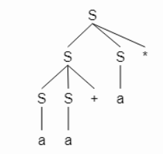
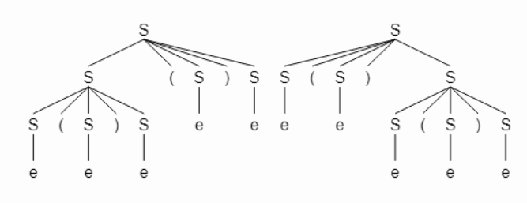
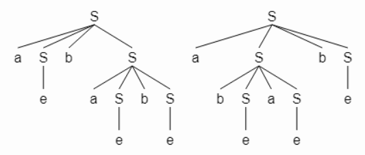
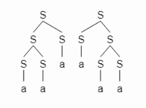

### 2.2.1

$$ 
S \rightarrow SS+ \ | \ SS* \ | \ a
$$

#### a) Show how the string <i>aa+a*</i> can be generated by this grammar

```C
// leftmost derivation
S
SS*
SS+ S * 
aS+ S * 
aa+ S *
aa+ a *
```

#### b) Construct a parse tree for this string

#### c) What language does this grammar generate? Justify your answer.  

Postfix expression


---

### 2.2.2

#### a) $S \rightarrow 0S1 \ | \ 01$
$S = \{0^k1^k \ | \ k \ge 1 \}$<br>
unambiguous

#### b) $S \rightarrow +SS \ | \ -SS \ | \ a$

prefix expression<br>
unambiguous

#### c) $S \rightarrow S(S)S  \ | \ \epsilon$

arbitrary arranged matched brackes <br>
ambiguous - $()()$


#### d) $S \rightarrow aSbS \ | \ bSaS \ | \ \epsilon$

a string consisting of $a$ and $b$ with the same amount <br>
ambiguous - $abab$

#### e) $S \rightarrow a \ | \ S+S \ | \ SS \ | \ S* \ | \ (S)$

what's it?.. <br>
ambiguous anyway - $aaa$



