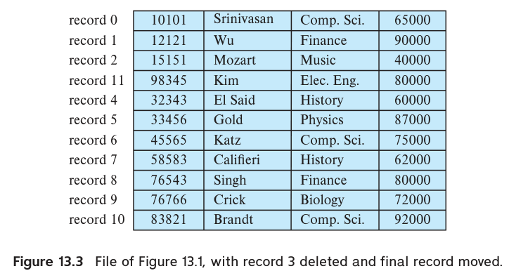

### 13.1

Consider the deletion of record 5 from the file of Figure 13.3. Compare the relative merits of the following techniques for implementing the deletion:

---

#### a. Move record 6 to the space occupied by record 5, and move record 7 to the space occupied by record 6.

Since there's still a gap, it's utterly futile. Those shifts were completely meaningless overhead. We need to maintain a freelist unless all the records following the deleted record 5 are shifted to ensure that all records are physically contiguous.

#### b. Move record 7 to the space occupied by record 5.

Similarly meaningless to the explanation above.

#### c. Mark record 5 as deleted, and move no records.

It's a reasonable approach. We need to maintain a free list to track these gaps and reuse them for later insertions. However, this tradeoff means that the records are no longer contiguous.

