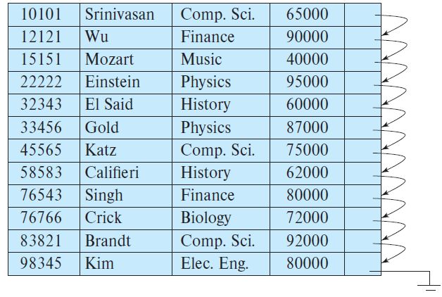

### 14.13
 Consider the _instructor_ relation shown in Figure 14.1. 

 ---
 
 #### a. Construct a bitmap index on the attribute _salary_, dividing _salary_ values  into four ranges; below $50,000$, $50,000$ to below $60,000$, $60,000$ to below $70,000$, and $70,000$ and above. 
 ```
 S1 0 0 1 0 0 0 0 0 0 0 0 0
 S2 0 0 0 0 0 0 0 0 0 0 0 0
 S3 1 0 0 0 1 0 0 1 0 0 0 0
 S4 0 1 0 1 0 1 1 0 1 1 1 1
 ```
 
 #### b. Consider a query that requests all instructors in the Finance department with a salary of $80,000$ or more. Outline the steps in answering the query, and show the final and intermediate bitmaps constructed to answer the query. 

```
Fi 0 1 0 0 0 0 0 0 1 0 0 0
S4 0 1 0 1 0 1 1 0 1 1 1 1
```
intersect them and do the final check for salary > 80000