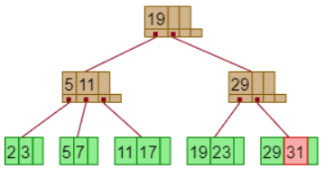

### 14.18

For each B+-tree of Exercise 14.3, show the steps involved in the following queries:

---


#### a. Find records with a search-key value of 11.

```19 -> 11 -> 11```
Detail omitted.

#### b. Find records with a search-key value between 7 and 17, inclusive.

Start with the operation ```search(7)```. Traverse the links, terminating when there are no more values or upon finding a value greater than 7.