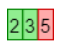
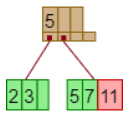
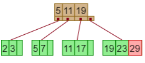
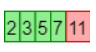
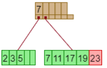
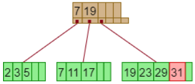
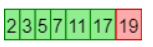
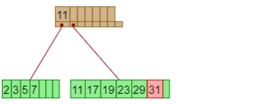

### 14.3

Construct a B+-tree for the following set of key values: $$ (2, 3, 5, 7, 11, 17, 19, 23, 29, 31) $$ Assume that the tree is initially empty and values are added in ascending order. Construct B+-trees for the case where the number of pointers that will fit in one node is as follows:

---

#### a. Four

+ 2,3,5 inserted  
  
+ 7, 11 inserted  

+ 17, 19 inserted  

+ 23, 29 inserted

+ 31 inserted

#### b. Six
+ 2,3,5,7,11 inserted   

+ 17,19,23 inserted   

+ 29, 31 inserted   

#### c. Eight
+ 2,3,5,7,11,17,19 inserted   

+ 23, 29, 31 inserted
