### 14.4

For each B+-tree of Exercise 14.3, show the form of the tree after each of the following series of operations:

---
#### n=4

+ Initial state

+ Insert 9
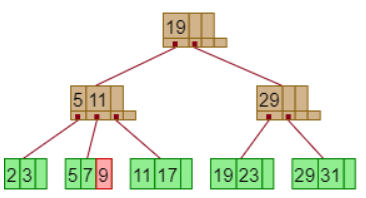
+ Insert 10
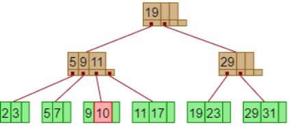
+ Insert 8
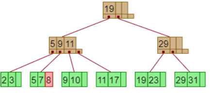
+ Delete 23 (leaf minimu)
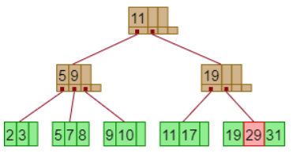
+ Delete 19  
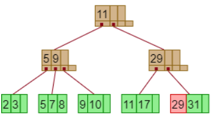
 The key 29 would have remained as 19 according to the text. (this version seems more reasonable though)

#### n=6

+ Initial state  
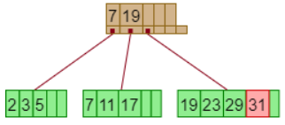
+ Insert 9  
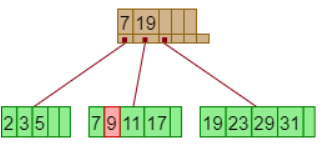
+ Insert 10
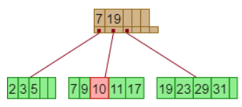
+ Insert 8
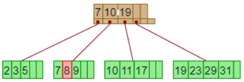
+ Delete 23
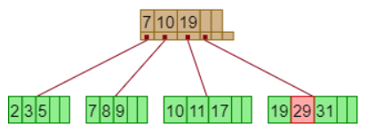
+ Delete 19  
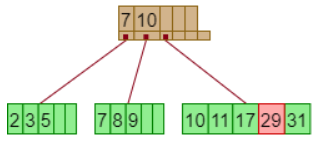

#### n=8

+ Initial state  
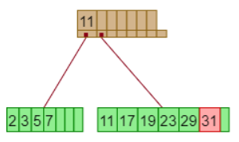
+ Insert 9  
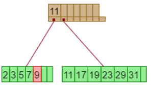
+ Insert 10
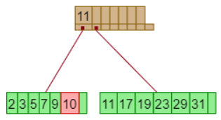
+ Insert 8
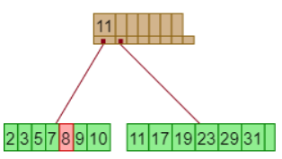
+ Delete 23
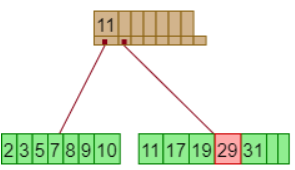
+ Delete 19  
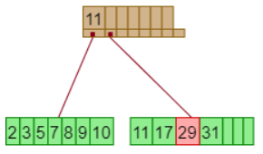