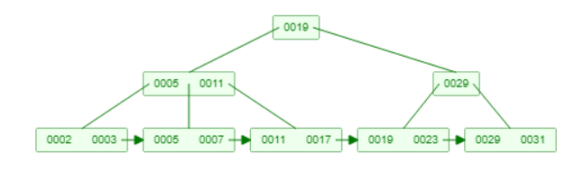
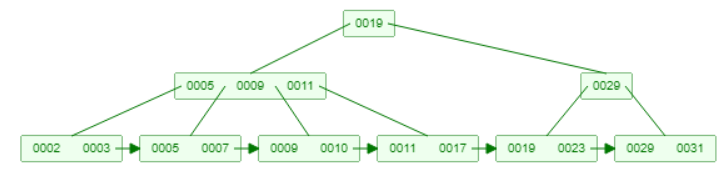
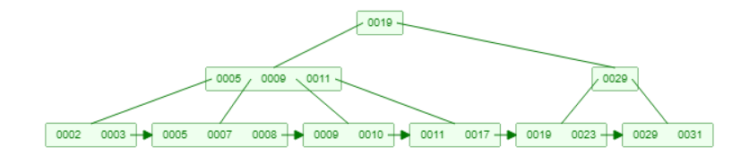
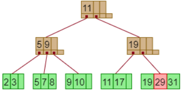

### 14.4

For each B+-tree of Exercise 14.3, show the form of the tree after each of the following series of operations:

---
#### n=4

+ initial state

+ insert 9

+ insert 10

+ insert 8

+ delete 23 (leaf minimu)

+ delete 19

a. Insert 9.
b. Insert 10.

c. Insert 8.

d. Delete 23.

e. Delete 19.