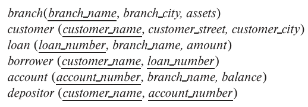

### 15.2

Consider the bank database of Figure 15.14, where the primary keys are underlined, and the following SQL query:
``` SQL
select T.branch_name
from branch T, branch S
where T.assets > S.assets and S.branch_city = “Brooklyn”
```

Write an efficient relational-algebra expression that is equivalent to this query.
Justify your choice.

---

$
s \leftarrow \Pi_{assets}(\sigma_{branch\_name='Brooklyn'}(branch) )
\\
t \leftarrow \Pi_{branch\_name, assets}(branch)
\\
\Pi_{branch\_name}(t \bowtie_{t.assets > s.assets} s)
$