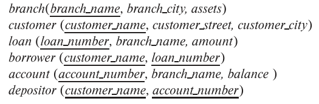

### 16.15

Consider the bank database of Figure 16.9, where the primary keys are under-
lined. Construct the following SQL queries for this relational database.



---


#### a. Write a nested query on the relation account to find, for each branch with name starting with B, all accounts with the maximum balance at the branch.
```SQL
SELECT A.account_number
FROM account AS A
WHERE branch_name LIKE 'B%'
    AND balance = (
        SELECT MAX(balance)
        FROM account AS B
        WHERE A.branch_name = B.branch_name
    )
```

#### b. Rewrite the preceding query without using a nested subquery; in other words, decorrelate the query, but in SQL.

```SQL
WITH max_balance(branch_name, balance) AS (
    SELECT branch_name, MAX(balance)
    FROM account
    GROUP BY branch_name
)

SELECT A.account_number
FROM account AS A, max_balance as B
WHERE A.branch_name LIKE 'B%' 
    AND B.branch_name = A.branch_name
    AND B.balance = A.balance
    
```

#### c. Give a relational algebra expression using semijoin equivalent to the query.

$
a \leftarrow \sigma_{branch\_name = 'B\%'}(account) \\
b \leftarrow _{branch\_name}\gamma_{max(balance) \ as \ balance}(account) \\
\Pi_{account\_number}(a \bowtie_{a.branch\_name = b.branch\_name \wedge a.balance = b.balance} b)
$

#### d. Give a procedure (similar to that described in Section 16.4.4) for decorrelating such queries.
omit