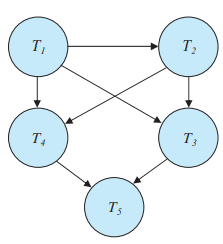

### 17.6

Consider the precedence graph of Figure 17.6. Is the corresponding schedule conflict serializable? 

---

Since there is no cycle in the graph, this schedule is conflict serializable. Any topological orderings of this graph is the one possible serial schedule, which is conflict equivalent to the given schedule.

$<T_1, T_2, T_3, T_4, T_5>$