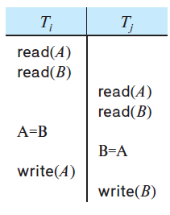

### 17.9

Consider a database for a bank where the database system uses a snapshot isolation. Describe a particular scenario in which a nonserializable execution occurs that would present a problem for the bank.

---

**WRITE SKEW PROBLEM**

#### 1. unintentional swap

Since each transaction updates a disjoint data item, both will pass the validation test for snapshot isolation. This results in a swap, which is impossible under any serializable schedule.

#### 2. Bank Run

Suppose there exists a constraint in a bank DBMS system that the sum of deposits in two accounts, A and B, must exceed 300.

| A   | B   |
|-----|-----|
| 200 | 200 |

$T_1$ withdraws 200 from $A$  
$T_2$ withdraws 200 from $B$

A concurrent schedule of $T_1$ and $T_2$ can lead to the following result, as they update disjoint items.

| A   | B   |
|-----|-----|
| 0   | 0   |

However, this result is not in a consistent state.

