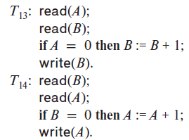

### 17.15

Consider the following two transactions

Let the consistency requirement be $A=0 \vee B=0$, with $A=B=0$ as the initial values.

----
#### a. Show that every serial execution involving these two transactions preserves the consistency of the database.

Easy


#### b. Show a concurrent execution of $T_{13}$ and $T_{14}$ that produces a nonserializable schedule.
| $T_{13}$ | $T_{14}$ |
|----------|----------|
| READ(A)  | READ(B)  |
| READ(B)  | READ(A)  |
|          |          |
| B=1      |          |
| WRITE(B) |          |
|          | A=1      |
|          | WRITE(A) |
|          |          |


#### c. Is there a concurrent execution of $T_{13}$ and $T_{14}$ that produces a serializable schedule?

Impossible. For any serializable schedule, the result must be either ```(A,B)=(1,0)``` or ```(A,B)=(0,1)```.

Without Loss of Generality, Let's assume that the $T_{13}$ started its execution first. By the time it reads the initial value of ```A=0```, no matter how the remaining operations are scheduled, the final value of ```B``` that is to be written out is ```1```. 

For this schedule to be serializable, ```A=0``` have to be written out, which means that the value of ```B``` that will be read by $T_{14}$ has to be ```1```. It means that this schedule has to be serial, non-concurrent.