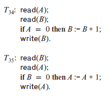

### 18.2

Consider the following two transactions


Add lock and unlock instructions to transactions $T_{31}$ and $T_{32}$ so that they observe the two-phase locking protocol. Can the execution of these transactions result in a deadlock?


---

This schedule can't executed concurrently while ensuring serializability! (See Excercise 17.15)

When executed under 2-phase Locking Protocol, The only possible cases are either serial scheduling or deadlock.

One possible deadlock schedule is as below.

| $T_{34}$       | $T_{35}$       |
|----------------|----------------|
| ```SLOCK(A)``` |                |
|                | ```SLOCK(B)``` |
| ```READ(A)```  |                |
| ```SLOCK(B)``` |                |
|                | ```READ(B)```  |
|                | ```SLOCK(A)``` |
|                |                |     