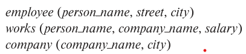

### 2.6
Consider the employee database of Figure 2.17. Give an expression in the relational algebra to express each of the following queries:

---

#### a. Find the name of each employee who lives in city "Miami".
$\Pi_{person\_name}(\sigma_{city='Miami'}(employee))$

#### b. Find the name of each employee whose salary is greater than $100000

$a \leftarrow employee \bowtie_{N} works \\
b \leftarrow \sigma_{salary >100000}(a) \\
\Pi_{person\_name}(b)$

#### c. Find the name of each employee who lives in "Miami" and whose salary is greater than $100000.

$a \leftarrow employee \bowtie_{N} works \\
b \leftarrow \sigma_{salary >100000 \ \wedge \ city='Miami'}(a) \\
\Pi_{person\_name}(b)$
