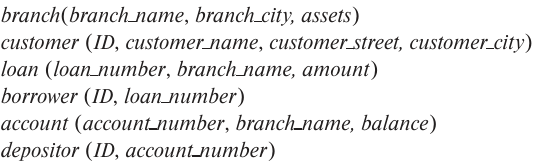

### 2.12

Consider the bank database of Figure 2.18. Assume that branch names and customer names uniquely identify branches and customers, but loans and accounts can be associated with moren than one customer.


---
#### a. What are the appropriate primary keys?

```
branch(branch_name)
customer(ID)
loan(loan_number)
borrower(ID, loan_number)
account(account_number)
depositor(ID, account_number)
```

#### b. Given your choice of primary keys, identify appropriate foreign keys.

```
loan(branch_name) -> branch
account(branch_name) -> branch

borrower(ID) -> customer
borrower(loan_number) -> loan

depositor(ID) -> customer
depositor(account_number) -> account
```

