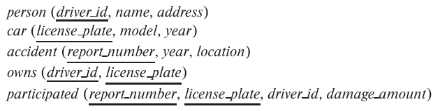

### 3.13 

Write SQL DDL corresponding to the schema in Figure 3.17. Make any reasonable assumptions about data types, and be sure to declare primary and foreign keys.



---

```SQL
CREATE TABLE person (
    driver_id VARCHAR(10),
    name, VARCHAR(10),
    address, VARCHAR(10),

    PRIMARY KEY(driver_id)
);

CREATE TABLE car(
    license_plate VARCHAR(10),
    model VARCHAR(10),
    year NUMERIC(4,0) CHECK (1900 < year AND year < 2100),

    PRIMARY KEY(license_plate)
);

CREATE TABLE accident(
    report_number VARCHAR(10),
    year NUMERIC(4,0) CHECK (1900 < year AND year < 2100),
    location VARCHAR(10),

    PRIMARY KEY(report_number)
);

CREATE TABLE owns(
    driver_id VARCHAR(10),
    license_plate VARCHAR(10),

    PRIMARY KEY(driver_id, license_plate),
    FOREIGN KEY(driver_id) REFERENCES person(driver_id) 
        ON DELETE CASCADE,
    FOREIGN KEY(license_plate) REFERENCES car(license_plate)
        ON DELETE CASCADE
);

CREATE TABLE participated(
    report_number VARCHAR(10),
    license_plate VARCHAR(10),
    driver_id VARCHAR(10),
    damage_amount NUMERIC(10,2)

    PRIMARY KEY(report_number, license_plate),
    FOREIGN KEY(report_number) REFERENCES accident(report_number),
    FOREIGN KEY(license_plate) REFERENCES car(license_plate)
);
```