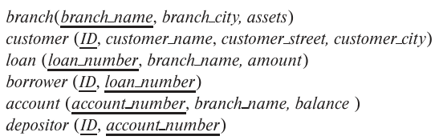

### 3.15
Consider the bank database of Figure 3.18, where the primary keys are under-
lined. Construct the following SQL queries for this relational database.



---

#### a. Find each customer who has an account at every branch located in "Brooklyn".
```SQL
SELECT *
FROM customer AS C
WHERE NOT EXISTS (
    -- all branches located in "Brooklyn"
    (
        SELECT branch_name
        FROM branch
        WHERE branch_city = 'Brooklyn'
    )
    EXCEPT
    -- the branches at which the C.ID has accounts
    (
        SELECT DISTINCT branch_name
        FROM account
        WHERE account_number IN (
            SELECT account_number
            FROM depositor AS D
            WHERE D.ID = C.ID
        )
    )
)
```
#### b. Find the total sum of all loan amounts in the bank.
```SQL
SELECT branch_name, SUM(amount) AS total_loan_amounts
FROM loan
GROUP BY branch_name
```

```SQL
-- ambiguous description..?
SELECT SUM(amount)
FROM loan
```
#### c. Find the names of all branches that have assets greater than those of at least one branch located in "Brooklyn"

```SQL
SELECT branch_name
FROM branch 
WHERE assets > SOME (
    SELECT assets
    FROM branch 
    WHERE branch_city = 'Brooklyn'
)
```