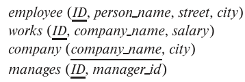

### 3.17
Consider the employee database of Figure 3.19. Give an expression in SQL for
each of the following queries.



---

#### a. Give all employees for "First Bank Corporation" a 10 percent raise.
```SQL
UPDATE works
SET salary = salary * 1.1
WHERE company_name = 'First Bank Corporation'
```
#### b. Give all managers of "First Bank Corporation" a 10 percent raise.
```SQL
UPDATE works
SET salary = salary * 1.1
WHERE company_name = 'First Bank Corporation' 
    AND ID IN (
        SELECT manager_id
        FROM managers
    )
```
#### c. Delete all tuples in the works relation for employees of "Small Bank Corporation".

```SQL
DELETE FROM works
WHERE company_name = 'Small Bank Corporation'
```

