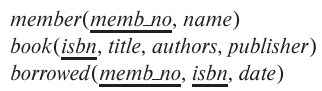

### 3.21

Consider the library database of Figure 3.20. Write the following queries in SQL.


---


#### a. Find the member number and name of each member who has borrowed at least one book published by "McGraw-Hill".

```SQL
SELECT memb_no, name
FROM member 
WHERE memb_no IN (
    SELECT memb_no
    FROM book NATURAL JOIN borrowed
    WHERE publisher = 'McGraw-Hill'
)

```
#### b. Find the member number and name of each member who has borrowed every book published by "McGraw-Hill".
```SQL
SELECT M.memb_no, M.name
FROM member AS M
WHERE NOT EXISTS(
    (
        SELECT isbn 
        FROM book
        WHERE publisher = 'McGraw-Hill'
    )
    EXCEPT
    (
        SELECT isbn
        FROM borrowed AS B
        WHERE B.memb_no = M.memb_no
    )
)
```
#### c. For each publisher, find the member number and name of each member who has borrowed more than five books of that publisher.
```SQL
SELECT M.memb_no, M.name, BK.publisher
FROM member AS M
    INNER JOIN borrowed AS B ON M.memb_no = B.memb_no
    INNER JOIN book as BK ON B.isbn = BK.isbn
GROUP BY M.memb_no, M.name, BK.publisher
HAVING COUNT(B.isbn) > 5 
```
#### d. Find the average number of books borrowed per member. Take into account that if a member does not borrow any books, then that member does not appear in the borrowed relation at all, but that member still counts in the average.
```SQL
-- using UNION
SELECT AVG(cnt)
FROM (
    (
        SELECT memb_no, COUNT(isbn) AS cnt
        FROM borrowed
        GROUP BY memb_no
    )
    UNION
    (
        SELECT memb_no, 0 AS cnt
        FROM member
        WHERE memb_no NOT IN (
            SELECT DISTINCT memb_no
            FROM borrowed
        )
    )
)
```

```SQL
-- using outer join
SELECT AVG(cnt)
FROM (
    SELECT COUNT(*) as cnt -- COUNT(isbn) (X)
    FROM member LEFT OUTER JOIN borrowed
        ON member.memb_no = borrowed.memb_no
    GROUP BY memb_no
)
```

```SQL
-- using CASE STMT

SELECT AVG(cnt)
FROM (
    SELECT 
        CASE
            WHEN NOT EXISTS(
                SELECT * 
                FROM borrowed
                WHERE borrowed.memb_no = member.memb_no
            ) THEN 0
            ELSE (
                SELECT CNT(isbn)
                FROM borrowed
                WHERE borrwoed.memb_no = member.memb_no
            )
        END AS cnt
    FROM member
)

```
