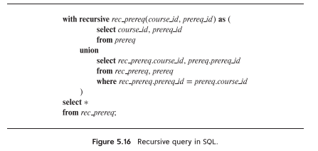

Modify the recursive query in Figure 5.16 to define a relation

$$ prereq\_depth(course\_id,prereq\_id,depth) $$

where the attribute depth indicates how many levels of intermediate prerequisites there are between the course and the prerequisite. Direct prerequisites have a depth of 0. Note that a prerequisite course may have multiple depths and thus may appear more than once.


```SQL
WITH RECURSIVE prereq_depth(course_id, prereq_id, depth) AS (
    -- BASE QUERY
    (
        SELECT course_id, prereq_id, 0
        FROM prereq
    )
    UNION
    -- RECURSIVE QUERY
    (
        SELECT prereq_depth.course_id, 
            prereq.prereq_id, 
            prereq_depth.depth + 1
        FROM prereq, prereq_depth
        WHERE prereq_depth.prereq_id = prereq.course_id
    )
)
```