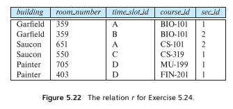

Consider the relation, r, shown in Figure 5.22. Give the result of the following query:


```SQL
SELECT building, room_number,time_slot_id,COUNT(*)
FROM r
GROUP BY ROLLUP(building,room_number,time_slot_id)
```

| building | room_number | time_slot_id | count(*) |
|----------|-------------|--------------|----------|
| Garfield | 359         | A            | 1        |
| Garfield | 359         | B            | 1        |
| Saucon   | 651         | A            | 1        |
| Saucon   | 550         | C            | 1        |
| Painter  | 705         | D            | 1        |
| Painter  | 403         | D            | 1        |
| Garfield | 359         | null         | 2        |
| Saucon   | 651         | null         | 1        |
| Saucon   | 550         | null         | 1        |
| Painter  | 705         | null         | 1        |
| Painter  | 403         | null         | 1        |
| Garfield | null        | null         | 2        |
| Saucon   | null        | null         | 2        |
| Painter  | null        | null         | 2        |
| null     | null        | null         | 6        |