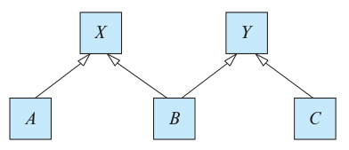

### 6.12

Consider the following lattice structure of generalization and specialization (at-
tributes not shown).

For entity sets A, B, and C, explain how attributes are inherited from the higher-
level entity sets X and Y. Discuss how to handle a case where an attribute of X
has the same name as some attribute of Y.

---

omit (common sense works out)