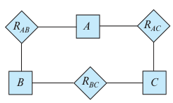

### 6.25

In Section 6.9.4, we represented a ternary relationship (repeated in Figure
6.29a) using binary relationships, as shown in Figure 6.29b. Consider the alter-
native shown in Figure 6.29c. Discuss the relative merits of these two alternative
representations of a ternary relationship by binary relationships.

---

binary is always better (if possible)

What can I say more? It may depends..