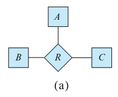
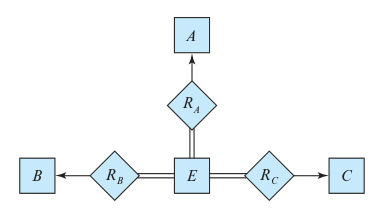

### 6.6

Consider the representation of the ternary relationship of Figure 6.29a using
the binary relationships illustrated in Figure 6.29b (attributes not shown).



#### a. Show a simple instance of E, A, B, C, RA, RB, and RC that cannot correspond to any instance of A, B, C, and R.

```
A = {a} B={b} C={c1, c2}
E = {e1}

RA = {(e1, a)}
RB = {(e1, b)}
RC = {(e1, c1), (e1,c2)}
```

#### b. Modify the E-R diagram of Figure 6.29b to introduce constraints that will guarantee that any instance of $E$, $A$, $B$, $C$, $R_A$, $R_B$, and $R_C$ that satisfies the constraints will correspond to an instance of $A$, $B$, $C$, and $R$.



#### c. Modify the preceding translation to handle total participation constraints on the ternary relationship.

add double line to the arrow pointing to the total participating entity sets.