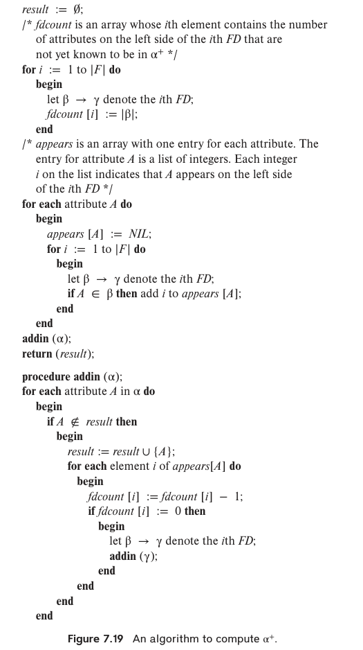

### 7.8

Consider the algorithm in Figure 7.19 to compute $\alpha^+$. Show that 
this algorithm is more efficient than the one presented in Figure 7.8 
(Section 7.4.2) and that it computes $\alpha^+$ correctly. 

---

TODO