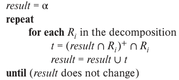

### 7.31 

Consider the schema $R = (A,B,C,D,E,G)$ and the set $F$ of functional dependencies: 
$$AB \rightarrow CD  \\
B \rightarrow D  \\
DE \rightarrow B \\
DEG \rightarrow AB \\
AC \rightarrow DE  \\$$

$R$ is not in BCNF for many reasons, one of which arises from the functional 
dependency $AB \rightarrow CD$. Explain why $AB \rightarrow CD$ shows that 
$R$ is not in BCNF and then use the BCNF decomposition algorithm starting with 
$AB \rightarrow CD$ to generate a BCNF decomposition of $R$. Once that is done, 
determine whether your result is or is not dependency preserving, and explain 
your reasoning.

---

1. BCNF Decomposition
```C++
AB+ = {A,B,C,D,E}
// not a super key
```

```C++
// AB->CD
(A,B,C,D) (A,B,E,G)

// B->D
(B,D) (A,B,C) (A,B,E,G)

/*
A+ = {A} B+ = {B} C+ = {C}
-> (A,B,C) okay

AB+ in (A,B,E,G) = {A,B,E}
AB -> E!!
*/
(B,D) (A,B,C) (A,B,E) (A,B,G)

// done
```




1. $AB \rightarrow CD$ (O)
```C++
//AB->CD
res = {A,B}
// (res &(B,D))+ -> {B,D}
res = {A,B,D}
// (res&(A,B,C))+ -> {A,B,C,D,E}
res = {A,B,C,D}
// CD contained
```

2. $B \rightarrow D$ (O)
3. $DE \rightarrow B$ (X)
```C++
res = {D,E}
// can not proceed anymore
```